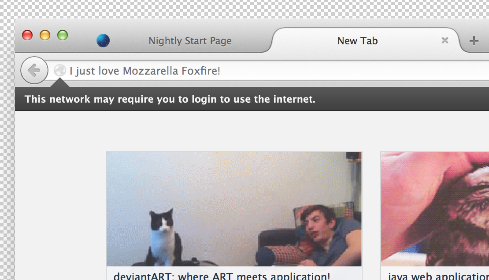
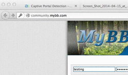

# Potential Info bar Redesign

## Background

One of the concerns expressed was that the info bar presented in the captive
portal spec could be easily spoofable because it is contained entirely in an
area that is in the content frame. A malicious attacker could trick the user
into thinking Firefox is communicating with them rather than the website itself.

## Proposed Solution

A better way of presenting the info bar so that it is clear the info bar
orientates from Firefox itself is proposed in *Figure 1*. Here we can see the
info bar breaks the content barrier, something a website would not be able to
do.

**Figure 1:** Proposed info bar

This would be combined with an animation similar to our doorhangers as seen in
*Figure 2*.

### Potential problems

- What happens when Firefox wants to display both an info bar and a doorhanger
at the same time?
  - When does this situation occur, if at all?
